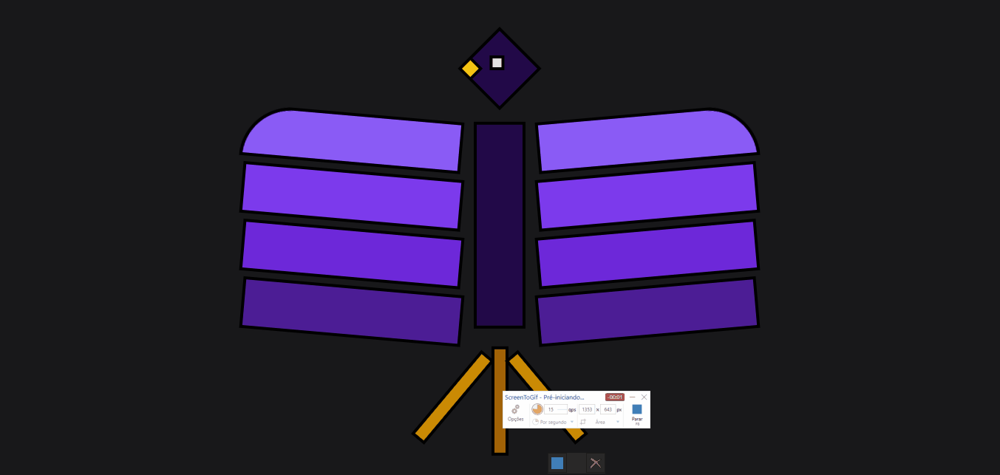

## 🚀 30diasDeCSS 🚀
 
 Fala Devs, beleza? 🖖

 30 dias de CSS3 é um desafio que visa ajudá-lo a melhorar suas habilidades de codificação fazendo mini projetos diarios utilizando HTML5 e CSS3 

 ## Objetivo

30 dias de CSS3 é um desafio que vou aceitar (e você também pode participar) a partir de 11 de Novembro de 2020, que visa melhorar minhas habilidades em HTML5 e CSS3 através da realização de projetos 

***Se você chegou agora e quer começar o desafio, fique a vontade, o desafio não tem data de inicio fixa, cada um faz os seus 30 dias, eu ficarei honrada com sua participação 😉***

## Regras gerais

* Realizar um projeto por dia
* Compartilhe seu progresso nas mídias sociais (Twitter, Facebook, Linkedin etc.) usando a hashtag #30diasDeCSS
* O projeto deve ser concluído até 23:59

Gostou da ideia? 
[Clique aqui](https://github.com/MilenaCarecho/30diasDeCSS/issues/1) para participar 

#### Youtube Referencias dos desafios
[Online Tutorials](https://www.youtube.com/channel/UCbwXnUipZsLfUckBPsC7Jog) - 
[Creative Creations](https://www.youtube.com/channel/UCOKmVksbzoKJKmtu7rlEM1A) - 
[DarkCode](https://www.youtube.com/channel/UCD3KVjbb7aq2OiOffuungzw)

* [Dia 01 - Efeitos Hover em cartões empilhados](#id01)
* [Dia 02 - Botão com efeito de transição hover](#id02)
* [Dia 03 - Cards direcionados com efeito hover](#id03)
* [Dia 04 - Ícones saltitantes](#id04)
* [Dia 05 - Tela de Carregamento](#id05)
* [Dia 06 - Sun-Moon Transition](#id06)
* [Dia 07 - Cards com Transições Hover](#id07)
* [Dia 08 - Acenda a luz!](#id08)
* [Dia 09 - Planetário](#id09)
* [Dia 10 - Tela de Carregamento Circular](#id10)
* [Dia 11 - Fylo data storage component](#id11)
* [Dia 12 - The Power of The Hand](#id12)
* [Dia 13 - Go Go Power Rangers!](#id13)
* [Dia 14 - Botão com bolinhas rotatórias](#id14)
* [Dia 15 - PAC MAN](#id15)
* [Dia 16 - Rainbow Panel](#id16)
* [Dia 17 - Efeito Pisada](#id17)
* [Dia 18 - Loader](#id18)
* [Dia 19 - Card com efeitos hover e focus](#id19)
* [Dia 20 - Loader Ninja](#id20)
* [Dia 21 - Ícones com Efeito Hover](#id21)
* [Dia 22 - Galinha Saltitante](#id22)
* [Dia 23 - Card flip + Redes Sociais](#id23)
* [Dia 24 - Botão com efeito Hover](#id24)
* [Dia 25 - Pássaro Geométrico](#id25)
* [Dia 26 - Cards Animais](#id26)

##  Desafio dia 01 - Efeitos Hover em cartões empilhados 

[Meu codigo](https://github.com/JulianePires/30diasDeCSS/tree/main/desafios/dia1)

[Tutorial Medium]() *Ainda não disponivel*

[Post LinkedIn](https://www.linkedin.com/posts/juliane-pires_30diasdecss-frontend-css-activity-6732376479906226176-yk7k) 

##### O que eu aprendi

* *Utilizar índices para aplicar variações em elementos semelhantes*
* *tranformação 2D ou 3D de um elemento [aqui](https://www.w3schools.com/cssref/css3_pr_transform.asp)*
* *[Transições CSS](https://www.w3schools.com/css/css3_transitions.asp)*
* *[Opacidade / transparência do CSS](https://www.w3schools.com/css/css_image_transparency.asp)*
* *[hover](https://www.w3schools.com/cssref/sel_hover.asp)*
* *[nth-child ()](https://www.w3schools.com/cssref/sel_nth-child.asp)*

##  Desafio dia 02 - Botão com efeito hover 

[Meu codigo](https://github.com/JulianePires/30diasDeCSS/tree/main/desafios/dia2)

[Tutorial Medium]() *Ainda não disponivel*

[Post LinkedIn](https://www.linkedin.com/posts/juliane-pires_30diasdecss-css-challenge-activity-6732649269007831040-Fz4H) 

##### O que eu aprendi

* *tranformação 2D ou 3D de um elemento [aqui](https://www.w3schools.com/cssref/css3_pr_transform.asp)*
* *[Transições CSS](https://www.w3schools.com/css/css3_transitions.asp)*
* *[Pseudo-Elementos](https://developer.mozilla.org/pt-BR/docs/Web/CSS/Pseudo-elementos)*
* *[hover](https://www.w3schools.com/cssref/sel_hover.asp)*

##  Desafio dia 03 - Cards direcionados com efeito hover 

[Meu codigo](https://github.com/JulianePires/30diasDeCSS/tree/main/desafios/dia3)

[Tutorial Medium]() *Ainda não disponivel*

[Post LinkedIn](https://www.linkedin.com/posts/juliane-pires_30diasdecss-css-challenge-activity-6733008482770989056-VRuU) 

##### O que eu aprendi

* *tranformação 2D ou 3D de um elemento [aqui](https://www.w3schools.com/cssref/css3_pr_transform.asp)*
* *[Transform-Style](https://www.w3schools.com/cssref/css3_pr_transform-style.asp)*
* *[Transições CSS](https://www.w3schools.com/css/css3_transitions.asp)*
* *[Box-shadow](https://developer.mozilla.org/pt-BR/docs/Web/CSS/box-shadow)*
* *[Sibling Selectors](https://developer.mozilla.org/pt-BR/docs/Web/CSS/General_sibling_combinator)*
* *[Perspective Property](https://www.w3schools.com/cssref/css3_pr_perspective.asp)*
* *[hover](https://www.w3schools.com/cssref/sel_hover.asp)*

## Desafio dia 04 - Ícones saltitantes 

[Meu codigo](https://github.com/JulianePires/30diasDeCSS/tree/main/desafios/dia4)

[Tutorial Medium]() *Ainda não disponivel*

[Post LinkedIn](https://www.linkedin.com/posts/juliane-pires_30diasdecss-css-challenge-activity-6734120788745617409-Nxeq) 

##### O que eu aprendi

* *tranformação 2D ou 3D de um elemento [aqui](https://www.w3schools.com/cssref/css3_pr_transform.asp)*
* *[Keyframe](https://www.w3schools.com/cssref/css3_pr_animation-keyframes.asp)*
* *[Transições CSS](https://www.w3schools.com/css/css3_transitions.asp)*
* *[Scale](https://developer.mozilla.org/pt-BR/docs/Web/CSS/transform-function/scale)*
* *[Translate](https://developer.mozilla.org/pt-BR/docs/Web/CSS/transform-function/translate)*
* *[Fontawesome icons](https://www.w3schools.com/icons/fontawesome_icons_intro.asp)*
* *[Box-shadow](https://developer.mozilla.org/pt-BR/docs/Web/CSS/box-shadow)*

## Desafio dia 05 - Tela de Carregamento 

[Meu codigo](https://github.com/JulianePires/30diasDeCSS/tree/main/desafios/dia5)

[Tutorial Medium]() *Ainda não disponivel*

[Post LinkedIn](https://www.linkedin.com/posts/juliane-pires_30diasdecss-css-challenge-activity-6734558787111321600-Uebx) 

##### O que eu aprendi

* *tranformação 2D ou 3D de um elemento [aqui](https://www.w3schools.com/cssref/css3_pr_transform.asp)*
* *[Keyframe](https://www.w3schools.com/cssref/css3_pr_animation-keyframes.asp)*
* *[Transições CSS](https://www.w3schools.com/css/css3_transitions.asp)*
* *[Scale](https://developer.mozilla.org/pt-BR/docs/Web/CSS/transform-function/scale)*
* *[Transform-origin](https://www.w3schools.com/cssref/css3_pr_transform-origin.asp)*
* *[Gradients](https://www.w3schools.com/css/css3_gradients.asp)*
* *[Filter](https://www.w3schools.com/cssref/css3_pr_filter.asp)*
* *[Animations](https://www.w3schools.com/css/css3_animations.asp)*

## Desafio dia 06 - Sun-Moon Transition 

[Meu codigo](https://github.com/JulianePires/30diasDeCSS/tree/main/desafios/dia6)

[Tutorial Medium]() *Ainda não disponivel*

[Post LinkedIn](https://www.linkedin.com/posts/juliane-pires_30diasdecss-css-challenge-activity-6734848033441267712-az8C) 

##### O que eu aprendi

* *tranformação 2D ou 3D de um elemento [aqui](https://www.w3schools.com/cssref/css3_pr_transform.asp)*
* *[Keyframe](https://www.w3schools.com/cssref/css3_pr_animation-keyframes.asp)*
* *[Transições CSS](https://www.w3schools.com/css/css3_transitions.asp)*
* *[Overflow](https://www.w3schools.com/css/css_overflow.asp)*
* *[Animations](https://www.w3schools.com/css/css3_animations.asp)*

## Desafio dia 07 - Cards responsivos com transição hover 

[Meu codigo](https://github.com/JulianePires/30diasDeCSS/tree/main/desafios/dia7)

[Tutorial Medium]() *Ainda não disponivel*

[Post LinkedIn](https://www.linkedin.com/posts/juliane-pires_30diasdecss-css-challenge-activity-6734848033441267712-az8C) 

##### O que eu aprendi

* *tranformação 2D ou 3D de um elemento [aqui](https://www.w3schools.com/cssref/css3_pr_transform.asp)*
* *[hover](https://www.w3schools.com/cssref/sel_hover.asp)*
* *[Transições CSS](https://www.w3schools.com/css/css3_transitions.asp)*
* *[Visibility](https://developer.mozilla.org/pt-BR/docs/Web/CSS/visibility#:~:text=The%20element%20box%20is%20invisible,have%20visibility%20set%20to%20visible%20.)*
* *[Flex-direction](https://developer.mozilla.org/pt-BR/docs/Web/CSS/flex-direction#:~:text=A%20propriedade%20CSS%20flex%2Ddirection,dire%C3%A7%C3%A3o%20(normal%20ou%20invertido).)*

## Desafio dia 08 - Acenda a luz! 

[Meu codigo](https://github.com/JulianePires/30diasDeCSS/tree/main/desafios/dia8)

[Tutorial Medium]() *Ainda não disponivel*

[Post LinkedIn](https://www.linkedin.com/posts/juliane-pires_30diasdecss-css-challenge-activity-6734848033441267712-az8C) 

##### O que eu aprendi

* *[hover](https://www.w3schools.com/cssref/sel_hover.asp)*
* *[Visibility](https://developer.mozilla.org/pt-BR/docs/Web/CSS/visibility#:~:text=The%20element%20box%20is%20invisible,have%20visibility%20set%20to%20visible%20.)*
* *[Flex-direction](https://developer.mozilla.org/pt-BR/docs/Web/CSS/flex-direction#:~:text=A%20propriedade%20CSS%20flex%2Ddirection,dire%C3%A7%C3%A3o%20(normal%20ou%20invertido).)*
* *[Gradients](https://www.w3schools.com/css/css3_gradients.asp)*
* *[Filter](https://www.w3schools.com/cssref/css3_pr_filter.asp)*
* *[Sibling Selectors](https://developer.mozilla.org/pt-BR/docs/Web/CSS/General_sibling_combinator)*

## Desafio dia 09 - Planetário 

[Meu codigo](https://github.com/JulianePires/30diasDeCSS/tree/main/desafios/dia9)

[Tutorial Medium]() *Ainda não disponivel*

[Post LinkedIn](https://www.linkedin.com/posts/juliane-pires_30diasdecss-css-challenge-activity-6736661799380295680-n-zs) 

##### O que eu aprendi

* *[hover](https://www.w3schools.com/cssref/sel_hover.asp)*
* *[Visibility](https://developer.mozilla.org/pt-BR/docs/Web/CSS/visibility#:~:text=The%20element%20box%20is%20invisible,have%20visibility%20set%20to%20visible%20.)*
* *[Sibling Selectors](https://developer.mozilla.org/pt-BR/docs/Web/CSS/General_sibling_combinator)*
* *[Position](https://developer.mozilla.org/pt-BR/docs/Web/CSS/position)*

## Desafio dia 10 - Tela de Carregamento Circular 

[Meu codigo](https://github.com/JulianePires/30diasDeCSS/tree/main/desafios/dia10)

[Tutorial Medium]() *Ainda não disponivel*

[Post LinkedIn](https://www.linkedin.com/posts/juliane-pires_30diasdecss-css-challenge-activity-6737053203755544576-a1-s) 

##### O que eu aprendi

* *tranformação 2D ou 3D de um elemento [aqui](https://www.w3schools.com/cssref/css3_pr_transform.asp)*
* *
* *[Box-shadow](https://developer.mozilla.org/pt-BR/docs/Web/CSS/box-shadow)*
* *[Keyframe](https://www.w3schools.com/cssref/css3_pr_animation-keyframes.asp)*
* *[Animations](https://www.w3schools.com/css/css3_animations.asp)*
* *[-Webkit-box-reflect](https://developer.mozilla.org/en-US/docs/Web/CSS/-webkit-box-reflect)*

## Desafio dia 11 - Fylo data storage component 

[Meu codigo](https://github.com/JulianePires/30diasDeCSS/tree/main/desafios/dia11)

[Tutorial Medium]() *Ainda não disponivel*

[Post LinkedIn](https://www.linkedin.com/posts/juliane-pires_30diasdecss-css-challenge-activity-6737400871098888192-S0eF) 

##### O que eu aprendi

* *[:root](https://developer.mozilla.org/pt-BR/docs/Web/CSS/:root)*
* *[Variável CSS](https://developer.mozilla.org/en-US/docs/Web/CSS/Using_CSS_custom_properties)*
* *[Media Query](https://www.w3schools.com/cssref/css3_pr_mediaquery.asp)*

## Desafio dia 12 - The power of the hand 

[Meu codigo](https://github.com/JulianePires/30diasDeCSS/tree/main/desafios/dia12)

[Tutorial Medium]() *Ainda não disponivel*

[Post LinkedIn](https://www.linkedin.com/posts/juliane-pires_30diasdecss-css-challenge-activity-6737759937646125056-6AWx) 

##### O que eu aprendi

* *[Z-index](https://www.w3schools.com/cssref/pr_pos_z-index.asp)*
* *[Animation](https://www.w3schools.com/css/css3_animations.asp)*
* *[Skew](https://developer.mozilla.org/en-US/docs/Web/CSS/transform-function/skew)*

## Desafio dia 13 - Go Go Power Rangers! 

[Meu codigo](https://github.com/JulianePires/30diasDeCSS/tree/main/desafios/dia13)

[Tutorial Medium]() *Ainda não disponivel*

[Post LinkedIn](https://www.linkedin.com/posts/juliane-pires_30diasdecss-css-challenge-activity-6738175682121138176-tEfS) 

##### O que eu aprendi

* *[Z-index](https://www.w3schools.com/cssref/pr_pos_z-index.asp)*
* *[Box-shadow](https://developer.mozilla.org/pt-BR/docs/Web/CSS/box-shadow)*
* *[hover](https://www.w3schools.com/cssref/sel_hover.asp)*
* *[Visibility](https://developer.mozilla.org/pt-BR/docs/Web/CSS/visibility#:~:text=The%20element%20box%20is%20invisible,have%20visibility%20set%20to%20visible%20.)*
* *[nth-child ()](https://www.w3schools.com/cssref/sel_nth-child.asp)*

## Desafio dia 14 - Botão com bolinhas rotatórias 

[Meu codigo](https://github.com/JulianePires/30diasDeCSS/tree/main/desafios/dia14)

[Tutorial Medium]() *Ainda não disponivel*

[Post LinkedIn](https://www.linkedin.com/posts/juliane-pires_30diasdecss-css-challenge-activity-6739269452115922944-8vGe) 

##### O que eu aprendi

* *[Z-index](https://www.w3schools.com/cssref/pr_pos_z-index.asp)*
* *[Box-shadow](https://developer.mozilla.org/pt-BR/docs/Web/CSS/box-shadow)*
* *[hover](https://www.w3schools.com/cssref/sel_hover.asp)*
* *[nth-child ()](https://www.w3schools.com/cssref/sel_nth-child.asp)*
* *[Animation](https://www.w3schools.com/css/css3_animations.asp)*
* *[Keyframe](https://www.w3schools.com/cssref/css3_pr_animation-keyframes.asp)*
* *[Transições CSS](https://www.w3schools.com/css/css3_transitions.asp)*

## Desafio dia 15 - PAC MAN 

[Meu codigo](https://github.com/JulianePires/30diasDeCSS/tree/main/desafios/dia15)

[Tutorial Medium]() *Ainda não disponivel*

[Post LinkedIn](https://www.linkedin.com/posts/juliane-pires_30diasdecss-css-challenge-activity-6739562802530320385-OIGt) 

##### O que eu aprendi

* *[Z-index](https://www.w3schools.com/cssref/pr_pos_z-index.asp)*
* *[Box-shadow](https://developer.mozilla.org/pt-BR/docs/Web/CSS/box-shadow)*
* *[nth-child ()](https://www.w3schools.com/cssref/sel_nth-child.asp)*
* *[Animation](https://www.w3schools.com/css/css3_animations.asp)*
* *[Keyframe](https://www.w3schools.com/cssref/css3_pr_animation-keyframes.asp)*
* *[Transições CSS](https://www.w3schools.com/css/css3_transitions.asp)*
* *[Posicionamento Absoluto](https://www.w3schools.com/css/css_positioning.asp)*

## Desafio dia 16 - Rainbow Panel 

[Meu codigo](https://github.com/JulianePires/30diasDeCSS/tree/main/desafios/dia16)

[Tutorial Medium]() *Ainda não disponivel*

[Post LinkedIn](https://www.linkedin.com/posts/juliane-pires_30diasdecss-css-challenge-activity-6739970694219657216-DI05) 

##### O que eu aprendi

* *[Box-shadow](https://developer.mozilla.org/pt-BR/docs/Web/CSS/box-shadow)*
* *[nth-child ()](https://www.w3schools.com/cssref/sel_nth-child.asp)*
* *[Animation](https://www.w3schools.com/css/css3_animations.asp)*
* *[Keyframe](https://www.w3schools.com/cssref/css3_pr_animation-keyframes.asp)*

## Desafio dia 17 - Efeito Pisada 

[Meu codigo](https://github.com/JulianePires/30diasDeCSS/tree/main/desafios/dia17)

[Tutorial Medium]() *Ainda não disponivel*

[Post LinkedIn](https://www.linkedin.com/posts/juliane-pires_30diasdecss-css-challenge-activity-6740393487344250881-PPiZ) 

##### O que eu aprendi
* *[Font Face](https://developer.mozilla.org/pt-BR/docs/Web/CSS/@font-face)*
* *[Animation](https://www.w3schools.com/css/css3_animations.asp)*
* *[Keyframe](https://www.w3schools.com/cssref/css3_pr_animation-keyframes.asp)*
* *[Z-index](https://www.w3schools.com/cssref/pr_pos_z-index.asp)*
* *[Visibility](https://developer.mozilla.org/pt-BR/docs/Web/CSS/visibility#:~:text=The%20element%20box%20is%20invisible,have%20visibility%20set%20to%20visible%20.)*

## Desafio dia 18 - Loader 

[Meu codigo](https://github.com/JulianePires/30diasDeCSS/tree/main/desafios/dia18)

[Tutorial Medium]() *Ainda não disponivel*

[Post LinkedIn](https://www.linkedin.com/posts/juliane-pires_30diasdecss-css-challenge-activity-6740966922139054081-sPWI) 

##### O que eu aprendi
* *[Animation](https://www.w3schools.com/css/css3_animations.asp)*
* *[Keyframe](https://www.w3schools.com/cssref/css3_pr_animation-keyframes.asp)*
* *[nth-child ()](https://www.w3schools.com/cssref/sel_nth-child.asp)*

## Desafio dia 19 - Card com efeitos hover e focus 

[Meu codigo](https://github.com/JulianePires/30diasDeCSS/tree/main/desafios/dia19)

[Tutorial Medium]() *Ainda não disponivel*

[Post LinkedIn](https://www.linkedin.com/posts/juliane-pires_30diasdecss-css-challenge-activity-6741889812472610817-I4l9) 

##### O que eu aprendi
* *[nth-child ()](https://www.w3schools.com/cssref/sel_nth-child.asp)*
* *[Z-index](https://www.w3schools.com/cssref/pr_pos_z-index.asp)*
* *[Transições CSS](https://www.w3schools.com/css/css3_transitions.asp)*
* *[Posicionamento Absoluto](https://www.w3schools.com/css/css_positioning.asp)*
* *[hover](https://www.w3schools.com/cssref/sel_hover.asp)*
* *[Pseudo-Elementos](https://developer.mozilla.org/pt-BR/docs/Web/CSS/Pseudo-elementos)*
* *[Sibling Selectors](https://developer.mozilla.org/pt-BR/docs/Web/CSS/General_sibling_combinator)*
* *[focus](https://developer.mozilla.org/pt-BR/docs/Web/CSS/:focus)*

## Desafio dia 20 - Loader Ninja 

[Meu codigo](https://github.com/JulianePires/30diasDeCSS/tree/main/desafios/dia20)

[Tutorial Medium]() *Ainda não disponivel*

[Post LinkedIn](https://www.linkedin.com/posts/juliane-pires_30diasdecss-css-challenge-activity-6742536828890574848-o6qk) 

##### O que eu aprendi
* *[-webkit-text-fill-color](https://developer.mozilla.org/en-US/docs/Web/CSS/-webkit-text-fill-color)*
* *[-webkit-background-clip](https://developer.mozilla.org/pt-BR/docs/Web/CSS/background-clip)*
* *[-webkit-linear-gradient](https://webkit.org/blog/1424/css3-gradients/)*
* *[Posicionamento Absoluto](https://www.w3schools.com/css/css_positioning.asp)*
* *[Transições CSS](https://www.w3schools.com/css/css3_transitions.asp)*
* *[Animation](https://www.w3schools.com/css/css3_animations.asp)*
* *[Keyframe](https://www.w3schools.com/cssref/css3_pr_animation-keyframes.asp)*

## Desafio dia 21 - Ícones com efeito hover 

[Meu codigo](https://github.com/JulianePires/30diasDeCSS/tree/main/desafios/dia21)

[Tutorial Medium]() *Ainda não disponivel*

[Post LinkedIn](https://www.linkedin.com/posts/juliane-pires_30diasdecss-css-challenge-activity-6742803491179290624-nSnG) 

##### O que eu aprendi
* *[Transições CSS](https://www.w3schools.com/css/css3_transitions.asp)*
* *[Animation](https://www.w3schools.com/css/css3_animations.asp)*
* *[Keyframe](https://www.w3schools.com/cssref/css3_pr_animation-keyframes.asp)*
* *[Pseudo-Elementos](https://developer.mozilla.org/pt-BR/docs/Web/CSS/Pseudo-elementos)*
* *[nth-child ()](https://www.w3schools.com/cssref/sel_nth-child.asp)*

## Desafio dia 22 - Ícones com efeito hover 

[Meu codigo](https://github.com/JulianePires/30diasDeCSS/tree/main/desafios/dia22)

[Tutorial Medium]() *Ainda não disponivel*

[Post LinkedIn](https://www.linkedin.com/posts/juliane-pires_30diasdecss-css-challenge-activity-6743292707529142272-OVnj) 

##### O que eu aprendi
* *[Transições CSS](https://www.w3schools.com/css/css3_transitions.asp)*
* *[Animation](https://www.w3schools.com/css/css3_animations.asp)*
* *[Keyframe](https://www.w3schools.com/cssref/css3_pr_animation-keyframes.asp)*
* *[nth-child ()](https://www.w3schools.com/cssref/sel_nth-child.asp)*
* *[Z-index](https://www.w3schools.com/cssref/pr_pos_z-index.asp)*

## Desafio dia 23 - Card flip + redes sociais 

[Meu codigo](https://github.com/JulianePires/30diasDeCSS/tree/main/desafios/dia23)

[Tutorial Medium]() *Ainda não disponivel*

[Post LinkedIn](https://www.linkedin.com/posts/juliane-pires_30diasdecss-challenge-css-activity-6744660748716302337-ZyS2) 

##### O que eu aprendi
* *[Transições CSS](https://www.w3schools.com/css/css3_transitions.asp)*
* *[backface-visibility](https://developer.mozilla.org/pt-BR/docs/Web/CSS/backface-visibility)*
* *[Z-index](https://www.w3schools.com/cssref/pr_pos_z-index.asp)*

## Desafio dia 24 - Botão com efeito hover 

[Meu codigo](https://github.com/JulianePires/30diasDeCSS/tree/main/desafios/dia24)

[Tutorial Medium]() *Ainda não disponivel*

[Post LinkedIn](https://www.linkedin.com/posts/juliane-pires_30diasdecss-css-challenge-activity-6745125854029918208-D2Ih) 

##### O que eu aprendi
* *[Transições CSS](https://www.w3schools.com/css/css3_transitions.asp)*
* *[Pseudo-Elementos](https://developer.mozilla.org/pt-BR/docs/Web/CSS/Pseudo-elementos)*
* *[hover](https://www.w3schools.com/cssref/sel_hover.asp)*

## Desafio dia 25 - Pássaro Geométrico 

[Meu codigo](https://github.com/JulianePires/30diasDeCSS/tree/main/desafios/dia25)

[Tutorial Medium]() *Ainda não disponivel*

[Post LinkedIn](https://www.linkedin.com/posts/juliane-pires_30diasdecss-css-challenge-activity-6745420808052645888-OoJ1) 

##### O que eu aprendi
* *[Transições CSS](https://www.w3schools.com/css/css3_transitions.asp)*
* *[backface-visibility](https://developer.mozilla.org/pt-BR/docs/Web/CSS/backface-visibility)*
* *[Animation](https://www.w3schools.com/css/css3_animations.asp)*
* *[Keyframe](https://www.w3schools.com/cssref/css3_pr_animation-keyframes.asp)*
* *[nth-child ()](https://www.w3schools.com/cssref/sel_nth-child.asp)*

## Desafio dia 26 - Cards Animais 

[Meu codigo](https://github.com/JulianePires/30diasDeCSS/tree/main/desafios/dia26)

[Tutorial Medium]() *Ainda não disponivel*

[Post LinkedIn](https://www.linkedin.com/posts/juliane-pires_30diasdecss-css-challenge-activity-6746075041202524160-ILLg) 

##### O que eu aprendi
* *[Transições CSS](https://www.w3schools.com/css/css3_transitions.asp)*
* *[Animation](https://www.w3schools.com/css/css3_animations.asp)*
* *[Keyframe](https://www.w3schools.com/cssref/css3_pr_animation-keyframes.asp)*
* *[nth-child ()](https://www.w3schools.com/cssref/sel_nth-child.asp)*

## Desafio dia 27 - Cup Set 

[Meu codigo](https://github.com/JulianePires/30diasDeCSS/tree/main/desafios/dia27)

[Tutorial Medium]() *Ainda não disponivel*

[Post LinkedIn](https://www.linkedin.com/posts/juliane-pires_30diasdecss-css-challenge-activity-6746981254417190912-DJ_Q) 

##### O que eu aprendi
* *[Transições CSS](https://www.w3schools.com/css/css3_transitions.asp)*
* *[nth-child ()](https://www.w3schools.com/cssref/sel_nth-child.asp)*
* *[neumorphism](https://medium.com/codee-myndset/neomorfismo-no-desenvolvimento-web-mobile-7fedc717431b)*
* *[outline-style](https://www.w3schools.com/cssref/pr_outline-style.asp)*
* 