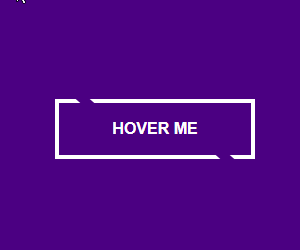
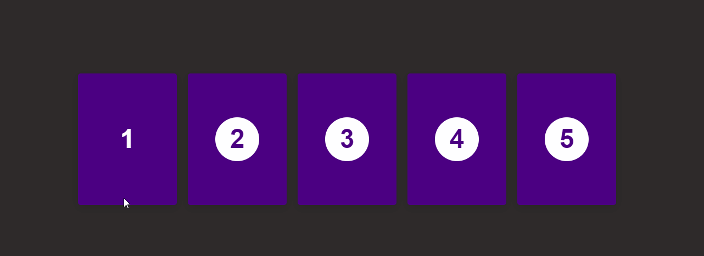
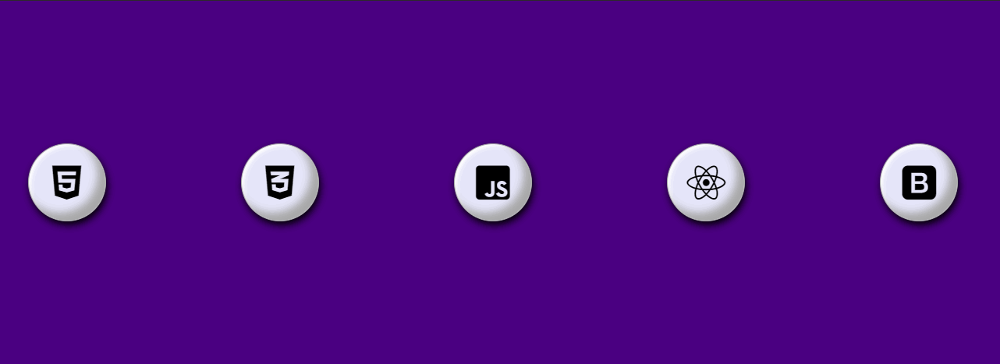
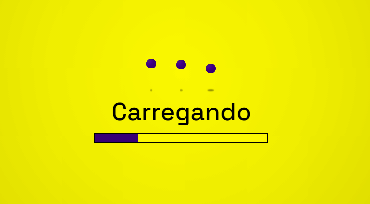
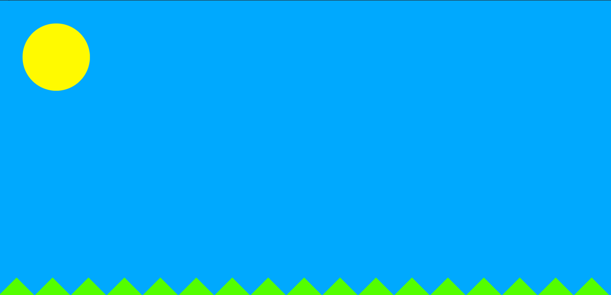
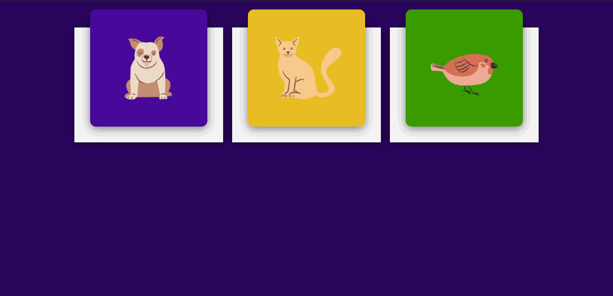
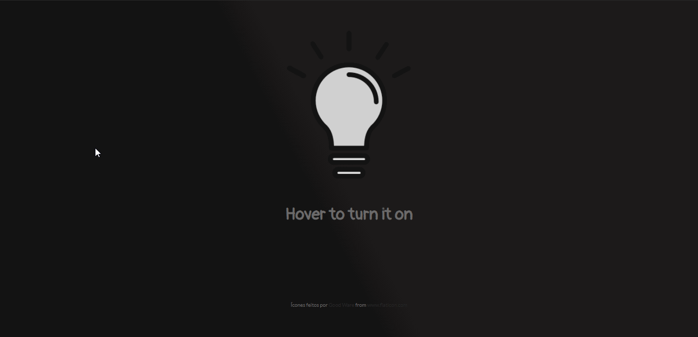
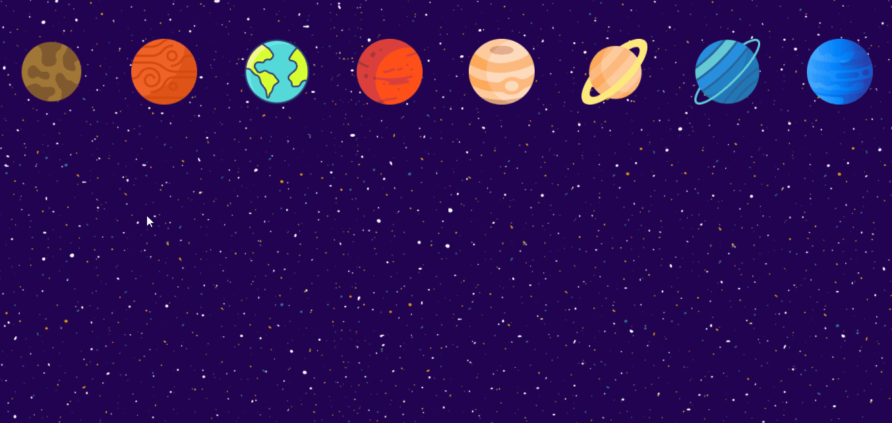

## 🚀 30diasDeCSS 🚀
 
 Fala Devs, beleza? 🖖

 30 dias de CSS3 é um desafio que visa ajudá-lo a melhorar suas habilidades de codificação fazendo mini projetos diarios utilizando HTML5 e CSS3 

 ## Objetivo

30 dias de CSS3 é um desafio que vou aceitar (e você também pode participar) a partir de 11 de Novembro de 2020, que visa melhorar minhas habilidades em HTML5 e CSS3 através da realização de projetos 

***Se você chegou agora e quer começar o desafio, fique a vontade, o desafio não tem data de inicio fixa, cada um faz os seus 30 dias, eu ficarei honrada com sua participação 😉***

## Regras gerais

* Realizar um projeto por dia
* Compartilhe seu progresso nas mídias sociais (Twitter, Facebook, Linkedin etc.) usando a hashtag #30diasDeCSS
* O projeto deve ser concluído até 23:59

Gostou da ideia? 
[Clique aqui](https://github.com/MilenaCarecho/30diasDeCSS/issues/1) para participar 

#### Youtube Referencias dos desafios
[Online Tutorials](https://www.youtube.com/channel/UCbwXnUipZsLfUckBPsC7Jog) - 
[Creative Creations](https://www.youtube.com/channel/UCOKmVksbzoKJKmtu7rlEM1A) - 
[DarkCode](https://www.youtube.com/channel/UCD3KVjbb7aq2OiOffuungzw)

* [Dia 01 - Efeitos Hover em cartões empilhados](#id01)
* [Dia 02 - Botão com efeito de transição hover](#id02)
* [Dia 03 - Cards direcionados com efeito hover](#id03)
* [Dia 04 - Ícones saltitantes](#id04)
* [Dia 05 - Tela de Carregamento](#id05)
* [Dia 06 - Sun-Moon Transition](#id06)
* [Dia 07 - Cards com Transições Hover](#id07)
* [Dia 08 - Acenda a luz!](#id08)
* [Dia 09 - Planetário](#id09)

##  Desafio dia 01 - Efeitos Hover em cartões empilhados 

[Meu codigo](https://github.com/JulianePires/30diasDeCSS/tree/main/desafios/dia1)

[Tutorial Medium]() *Ainda não disponivel*

[Post LinkedIn](https://www.linkedin.com/posts/juliane-pires_30diasdecss-frontend-css-activity-6732376479906226176-yk7k) 

##### O que eu aprendi

* *Utilizar índices para aplicar variações em elementos semelhantes*
* *tranformação 2D ou 3D de um elemento [aqui](https://www.w3schools.com/cssref/css3_pr_transform.asp)*
* *[Transições CSS](https://www.w3schools.com/css/css3_transitions.asp)*
* *[Opacidade / transparência do CSS](https://www.w3schools.com/css/css_image_transparency.asp)*
* *[hover](https://www.w3schools.com/cssref/sel_hover.asp)*
* *[nth-child ()](https://www.w3schools.com/cssref/sel_nth-child.asp)*

##  Desafio dia 02 - Botão com efeito hover 

[Meu codigo](https://github.com/JulianePires/30diasDeCSS/tree/main/desafios/dia2)

[Tutorial Medium]() *Ainda não disponivel*

[Post LinkedIn](https://www.linkedin.com/posts/juliane-pires_30diasdecss-css-challenge-activity-6732649269007831040-Fz4H) 

##### O que eu aprendi

* *tranformação 2D ou 3D de um elemento [aqui](https://www.w3schools.com/cssref/css3_pr_transform.asp)*
* *[Transições CSS](https://www.w3schools.com/css/css3_transitions.asp)*
* *[Pseudo-Elementos](https://developer.mozilla.org/pt-BR/docs/Web/CSS/Pseudo-elementos)*
* *[hover](https://www.w3schools.com/cssref/sel_hover.asp)*

##  Desafio dia 03 - Cards direcionados com efeito hover 

[Meu codigo](https://github.com/JulianePires/30diasDeCSS/tree/main/desafios/dia3)

[Tutorial Medium]() *Ainda não disponivel*

[Post LinkedIn](https://www.linkedin.com/posts/juliane-pires_30diasdecss-css-challenge-activity-6733008482770989056-VRuU) 

##### O que eu aprendi

* *tranformação 2D ou 3D de um elemento [aqui](https://www.w3schools.com/cssref/css3_pr_transform.asp)*
* *[Transform-Style](https://www.w3schools.com/cssref/css3_pr_transform-style.asp)*
* *[Transições CSS](https://www.w3schools.com/css/css3_transitions.asp)*
* *[Box-shadow](https://developer.mozilla.org/pt-BR/docs/Web/CSS/box-shadow)*
* *[Sibling Selectors](https://developer.mozilla.org/pt-BR/docs/Web/CSS/General_sibling_combinator)*
* *[Perspective Property](https://www.w3schools.com/cssref/css3_pr_perspective.asp)*
* *[hover](https://www.w3schools.com/cssref/sel_hover.asp)*

## Desafio dia 04 - Ícones saltitantes 

[Meu codigo](https://github.com/JulianePires/30diasDeCSS/tree/main/desafios/dia4)

[Tutorial Medium]() *Ainda não disponivel*

[Post LinkedIn](https://www.linkedin.com/posts/juliane-pires_30diasdecss-css-challenge-activity-6734120788745617409-Nxeq) 

##### O que eu aprendi

* *tranformação 2D ou 3D de um elemento [aqui](https://www.w3schools.com/cssref/css3_pr_transform.asp)*
* *[Keyframe](https://www.w3schools.com/cssref/css3_pr_animation-keyframes.asp)*
* *[Transições CSS](https://www.w3schools.com/css/css3_transitions.asp)*
* *[Scale](https://developer.mozilla.org/pt-BR/docs/Web/CSS/transform-function/scale)*
* *[Translate](https://developer.mozilla.org/pt-BR/docs/Web/CSS/transform-function/translate)*
* *[Fontawesome icons](https://www.w3schools.com/icons/fontawesome_icons_intro.asp)*
* *[Box-shadow](https://developer.mozilla.org/pt-BR/docs/Web/CSS/box-shadow)*

## Desafio dia 05 - Tela de Carregamento 

[Meu codigo](https://github.com/JulianePires/30diasDeCSS/tree/main/desafios/dia5)

[Tutorial Medium]() *Ainda não disponivel*

[Post LinkedIn](https://www.linkedin.com/posts/juliane-pires_30diasdecss-css-challenge-activity-6734558787111321600-Uebx) 

##### O que eu aprendi

* *tranformação 2D ou 3D de um elemento [aqui](https://www.w3schools.com/cssref/css3_pr_transform.asp)*
* *[Keyframe](https://www.w3schools.com/cssref/css3_pr_animation-keyframes.asp)*
* *[Transições CSS](https://www.w3schools.com/css/css3_transitions.asp)*
* *[Scale](https://developer.mozilla.org/pt-BR/docs/Web/CSS/transform-function/scale)*
* *[Transform-origin](https://www.w3schools.com/cssref/css3_pr_transform-origin.asp)*
* *[Gradients](https://www.w3schools.com/css/css3_gradients.asp)*
* *[Filter](https://www.w3schools.com/cssref/css3_pr_filter.asp)*
* *[Animations](https://www.w3schools.com/css/css3_animations.asp)*

## Desafio dia 06 - Sun-Moon Transition 

[Meu codigo](https://github.com/JulianePires/30diasDeCSS/tree/main/desafios/dia6)

[Tutorial Medium]() *Ainda não disponivel*

[Post LinkedIn](https://www.linkedin.com/posts/juliane-pires_30diasdecss-css-challenge-activity-6734848033441267712-az8C) 

##### O que eu aprendi

* *tranformação 2D ou 3D de um elemento [aqui](https://www.w3schools.com/cssref/css3_pr_transform.asp)*
* *[Keyframe](https://www.w3schools.com/cssref/css3_pr_animation-keyframes.asp)*
* *[Transições CSS](https://www.w3schools.com/css/css3_transitions.asp)*
* *[Overflow](https://www.w3schools.com/css/css_overflow.asp)*
* *[Animations](https://www.w3schools.com/css/css3_animations.asp)*

## Desafio dia 07 - Cards responsivos com transição hover 

[Meu codigo](https://github.com/JulianePires/30diasDeCSS/tree/main/desafios/dia7)

[Tutorial Medium]() *Ainda não disponivel*

[Post LinkedIn](https://www.linkedin.com/posts/juliane-pires_30diasdecss-css-challenge-activity-6734848033441267712-az8C) 

##### O que eu aprendi

* *tranformação 2D ou 3D de um elemento [aqui](https://www.w3schools.com/cssref/css3_pr_transform.asp)*
* *[hover](https://www.w3schools.com/cssref/sel_hover.asp)*
* *[Transições CSS](https://www.w3schools.com/css/css3_transitions.asp)*
* *[Visibility](https://developer.mozilla.org/pt-BR/docs/Web/CSS/visibility#:~:text=The%20element%20box%20is%20invisible,have%20visibility%20set%20to%20visible%20.)*
* *[Flex-direction](https://developer.mozilla.org/pt-BR/docs/Web/CSS/flex-direction#:~:text=A%20propriedade%20CSS%20flex%2Ddirection,dire%C3%A7%C3%A3o%20(normal%20ou%20invertido).)*

## Desafio dia 08 - Acenda a luz! 

[Meu codigo](https://github.com/JulianePires/30diasDeCSS/tree/main/desafios/dia8)

[Tutorial Medium]() *Ainda não disponivel*

[Post LinkedIn](https://www.linkedin.com/posts/juliane-pires_30diasdecss-css-challenge-activity-6734848033441267712-az8C) 

##### O que eu aprendi

* *[hover](https://www.w3schools.com/cssref/sel_hover.asp)*
* *[Visibility](https://developer.mozilla.org/pt-BR/docs/Web/CSS/visibility#:~:text=The%20element%20box%20is%20invisible,have%20visibility%20set%20to%20visible%20.)*
* *[Flex-direction](https://developer.mozilla.org/pt-BR/docs/Web/CSS/flex-direction#:~:text=A%20propriedade%20CSS%20flex%2Ddirection,dire%C3%A7%C3%A3o%20(normal%20ou%20invertido).)*
* *[Gradients](https://www.w3schools.com/css/css3_gradients.asp)*
* *[Filter](https://www.w3schools.com/cssref/css3_pr_filter.asp)*
* *[Sibling Selectors](https://developer.mozilla.org/pt-BR/docs/Web/CSS/General_sibling_combinator)*

## Desafio dia 09 - Planetário 

[Meu codigo](https://github.com/JulianePires/30diasDeCSS/tree/main/desafios/dia9)

[Tutorial Medium]() *Ainda não disponivel*

[Post LinkedIn](https://www.linkedin.com/posts/juliane-pires_30diasdecss-css-challenge-activity-6736661799380295680-n-zs) 

##### O que eu aprendi

* *[hover](https://www.w3schools.com/cssref/sel_hover.asp)*
* *[Visibility](https://developer.mozilla.org/pt-BR/docs/Web/CSS/visibility#:~:text=The%20element%20box%20is%20invisible,have%20visibility%20set%20to%20visible%20.)*
* *[Sibling Selectors](https://developer.mozilla.org/pt-BR/docs/Web/CSS/General_sibling_combinator)*
* *[Position](https://developer.mozilla.org/pt-BR/docs/Web/CSS/position)*